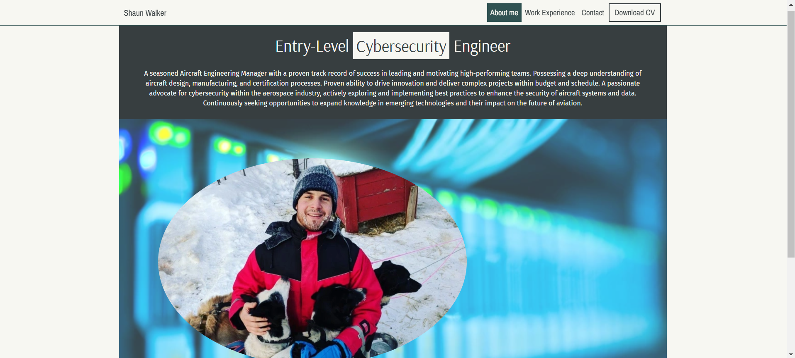

 

# Welcome to my Project Milestone 1

### Project Description

This is my first project milestone I've had to complete as part of Code Institute's Full Stack Web Application Development Programme. The website is of a minimalist design which showcases my experience within the Aviation sector and the experiences/skills I have obtained during my transition into Cybersecurity.

### Project Logo

------

## Table of contents

1. UX
   - Project goals
   - Design choices
   - Wireframes

2. Features
   - Existing features
   - Future features

3. Technologies used
   
4. Testing
   
5. Deployment

6. Credits
   - Code
   - Content
   - Media
   - Acknowledgements

------

## 1. UX

### Project goals

1. To create a website which was both responsive and fairly dynamic but also very simplitic.
2. To showcase my skills in using HTML, CSS and Bootstrap only.

### Design choices

- Minimalist
- Simplistic
- Clean
- Brief

### Wireframe

[Wireframe](assets/project_milestone_1_template.bmpr)

1. Desktop Wireframe

2. Tablet Wireframe

3. Mobile Wireframe

------

## 2. Features

### Existing Features

- __Navigation Bar__

  - Identically featured on all three pages, the full responsive navigation bar includes links to the "About me", "Work Experience", and "Contact" pages and a seperate link to the "Download CV" button.
  - Allows the user to easily navigate from page to page across all devices without having to use a "back" button.
 
- __Responsiveness__

   - The website is completely responsive on all devices from 280px to 1440 px.
 
- __The Footer__ 

  - This section includes links to the relevant social media sites. Opening in a new tab and allowing complete ease of access for the user.
 
### Future Features

- __Skills__

  - A "Technical Skills" page is yet to be added.

------

## 3. Technologies used

### Languages used

1. [HTML5](https://en.wikipedia.org/wiki/HTML)
2. [CSS3](https://en.wikipedia.org/wiki/CSS)

### Framework, Libraries, and programs used

1. [Bootstrap 5.3:](https://getbootstrap.com/)
   - Bootstrap has been used for overall formatting of the webpage.
2. [Google Fonts:](https://fonts.google.com/)
   - Google Fonts provided me with the 3 different fonts I have used.
3. [Font Awesome:](https://fontawesome.com/)
   - Font Awesome allowed me to use the icons required for the footer section.
4. [Gitpod:](https://www.gitpod.io/)
   - GitPod was used to write the code and commit and push to gitHub.
5. [GitHub:](https://github.com/)
   - GitHub is used to store and interact with the code once pushed from gitPod.
6. [Balsamiq:](https://balsamiq.com/)
   - Balsamiq has been used create the [wireframes](assets/project_milestone_1_template.bmpr) prior to writing the code.
7. [Fontjoy:](https://fontjoy.com/)
   - Fontjoy was used to generate 3 random font pairings.
8. [Coolors:](https://coolors.co/)
   - Coolors was used to generate random colour pairings for the overall design of the website.
9. [Hover.css:](https://ianlunn.github.io/Hover/)
   - Hover.css has been used to add the float transition to the social links in the footer section.
10. [CSS autoprefixer:](https://autoprefixer.github.io/)
   - Autoprefixer parsed my CSS and added vendor prefixes.
11. [Pexels:](https://www.pexels.com/)
   - Pexels has been used for the addition of stock photos.

------

## 4. Testing 

1. [HTML validator](https://validator.w3.org/)
2. [CSS validator](https://jigsaw.w3.org/css-validator/)

- The program has been tested on Google Chrome, Safari, and Microsoft Edge.
- The website has been viewed and tested on a variety of devices Samsung S23, Google Pixel 7, tablets and laptops.
- A large amount of testing has been carried out to ensure that there is full responsiveness for all device types.
- Family members viewed the site on their mobile devices and provided feedback throughout.

### Validator Testing 

1. HTML Validator Results
   - Initially there were a few issues with the HTML code (seen below), these errors have since been corrected.

   
2. CSS Validator Results
   - No CSS errors found, there are multiple warnings referencing the vendor prefixes (seen below).

### Known Bugs

- Added a ":focus-within" pseudo-class as an attempt to change the blue box shadow of the input forms on the contact page.
- Input forms on the contact page are not centered correctly on all mobile devices.

------

## 5. Deployment

### GitHub Pages
- The site was deployed to GitHub pages. The steps to deploy are as follows: 
  - In the specific [GitHub repository](https://github.com/), navigate to the "Settings" tab.
  - Scroll down until you see "pages" on the left-hand side.
  - From the "Branch" sub-section, under the "Build and Deployment" section, from the drop-down menu, select "main" and save.
  - You will find the deployed site under "Github Pages" showing your live site and it's URL, allowing you to navigate to the deployed website.

### Forking your GitHub Repository
- To make a copy of the original version so you can view and edit within your own GitHub repositories, you should do the following:
   - Locate the [GitHub repository](https://github.com/) in question.
   - At the top of the page, below the main menu, you will find the "Fork" button.
   - Select "Create a new fork" which will rediredct you to another page where you can change the description and title.
   - Select "Create fork" which will make a copy in your own GitHub repository.

The live link can be found [here](https://mybluewebsite.github.io/Project_Milestone_1/index.html).

------

## 6. Credits 

### Content 

- "Lorem ipsum" used as placeholder text throughout the website.
- The icons in the footer were taken from [Font Awesome](https://fontawesome.com/).
- [ChatGPT](https://chatgpt.com/) has been used to create a "::before" pseudo-class for the "Frequently Asked Questions" section to replace the bullet-points, 

### Media

- The photos used on all pages are either of my own belonging or obtained from [Pexels](https://www.pexels.com/).

### Acknowledgements

- Special thanks to [Code Institute](https://codeinstitute.net/) for providing a sample README to edit accordingly.
- Thank you to Spence, for providing tutor support and assisting me with the completion of this project.

---

 
